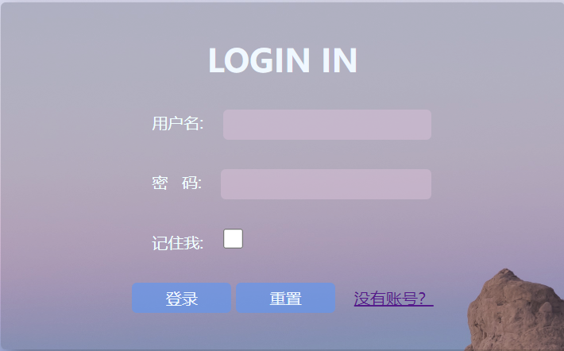
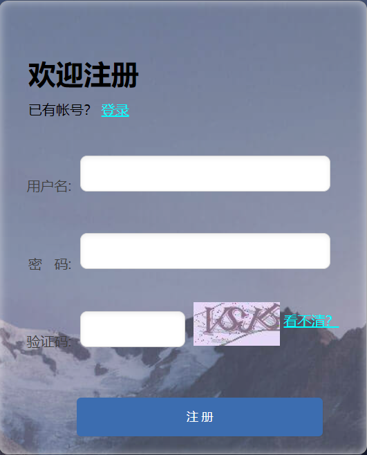
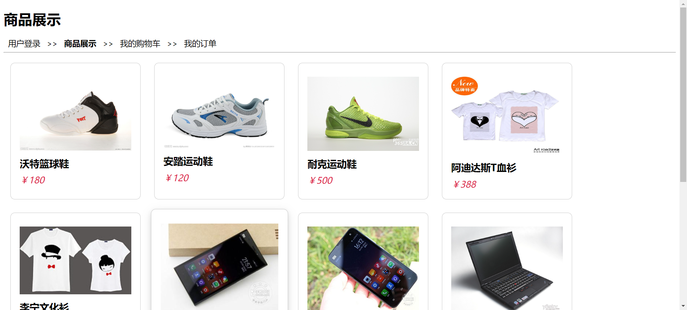
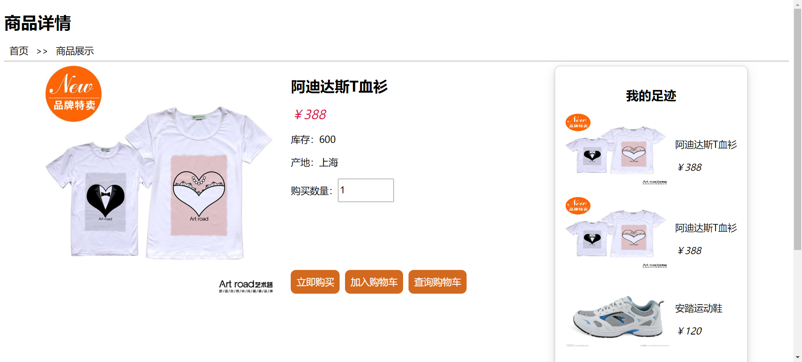
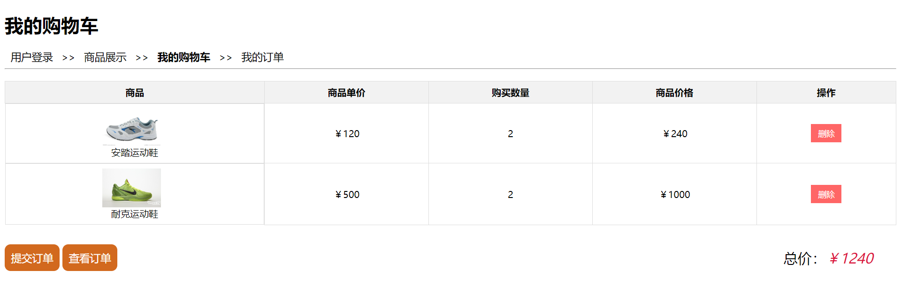
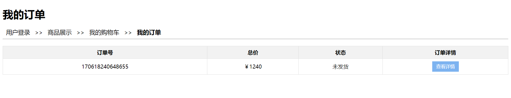

# 购物系统
[](https://github.com/huriver/shopping)
[](https://github.com/huriver/shopping)
[](https://github.com/huriver/shopping)
[](https://github.com/huriver/shopping/blob/master/LICENSE)


## 项目简介        

购物系统是我设计的一个Web课程设计项目，主要用于记录学习使用。后端基于改良后的 Servlet 技术与 Mybatis 框架，并用 MySQL 作为数据库来实现基本的购物网站功能。主要包括用户的登录及注册，商品信息的展示，购物车的交互操作，同时还具备订单的提交和查询功能。
<br><br>

## 项目目录结构

```
├─shopping
  └─src
    ├─main
    │ ├─java
    │ │ └─com
    │ │   └─ahut
    │ │     ├─mapper
    │ │     ├─pojo
    │ │     │ └─dto
    │ │     ├─service
    │ │     │ └─impl
    │ │     ├─util
    │ │     └─web
    │ │       ├─filter
    │ │       └─servlet
    │ ├─resources
    │ │ └─com
    │ │   └─ahut
    │ │     └─mapper
    │ └─webapp
    │   ├─css
    │   ├─imgs
    │   ├─js
    │   └─WEB-INF
      └─test
        └─java
```
<br>

## 主要功能

### 用户模块

- 用户可以通过该模块进行登录及注册操作实现身份认证。
- 在细节上，注册功能实现了验证码验证和用户名唯一性验证。同时，实现了登录拦截，未登录的用户不能随意访问资源。

<p align="center"><br>登录页面</p>  
<br>
<p align="center"><br>注册页面</p>
<br>

### 商品模块

- 该模块展示了所有的商品信息，用户在登录后可以查看商品详情。

<p align="center"><br>商品展示页面</p>
<br>
<p align="center"><br>商品详情页面</p>
<br>

### 购物车模块

- 为用户提供交互接口，用户登录后可将商品添加至购物车，支持添加商品、删除商品、清空购物车及计算总价格等操作。

<p align="center"><br>购物车页面</p>
<br>

### 订单模块

- 用户可以提交订单，系统将自动将订单信息保存至数据库，同时，用户可以查看自己的订单状态、订单号、总金额以及订单详情等信息。
<p align="center"><br>订单页面</p>
<br>

## 技术栈

- 前端：使用 HTML+CSS+Vue+axios 进行页面展示和异步请求的处理。
- 后端：基于 Servlet 和 Mybatis 框架进行开发，数据存储利用MySQL，项目依赖使用Maven进行管理。
<br><br>

## 环境配置

请确保以下环境及相关组件已正确安装，并确保 MySQL 服务器正在运行：
- JDK 8 或以上版本。
- Maven 3.6.1 或以上版本。
- IDEA 中需安装 Maven Helper 插件，否则可能无法用Maven进行项目构建。
<br><br>

## 快速开始

1. 先克隆本项目到本地：
```
git clone git@github.com:huriver/shopping.git
```

2. 在本地 MySQL中创建名为`web_design`的数据库，执行 `web_design.sql` 文件构建对应的数据库表，并在项目中的 `mybatis-config.xml` 文件中修改相应的数据库用户名和密码。

3. 在 IDEA中选中本项目，右键选择 Run Maven --> tomcat7:run，无报错信息后，打开浏览器访问`http://localhost:8080/shopping/login.html`查看项目是否运行成功。
<br><br>

## 许可信息

本项目采用 [Apache 2.0](http://www.apache.org/licenses/LICENSE-2.0) 许可，详情请参考 LICENSE 文件。

😜 如果能给你带来些许帮助，请给项目点点 Star 吧，这对我真的很重要！
<br><br><br><br>
